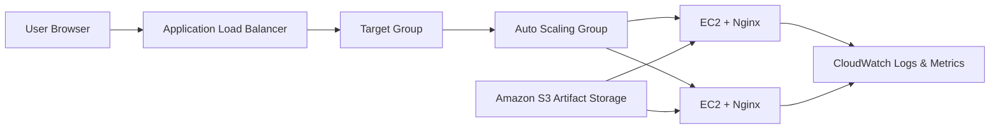

# Highly Available Web Application on AWS

A production-style AWS cloud infrastructure project demonstrating secure web hosting, load balancing, health checks, Auto Scaling, centralized logging, CPU monitoring, and S3-based deployment artifact management.

## Architecture



## AWS Services Used

| Service | Purpose |
|---|---|
| IAM | Role-based access for EC2 to read S3 artifacts and publish CloudWatch logs |
| Amazon S3 | Centralized storage for the application deployment ZIP |
| Amazon EC2 | Hosts the Nginx web application |
| Launch Template | Defines reusable EC2 configuration |
| Auto Scaling Group | Maintains capacity and performs CPU-based scale-out |
| Application Load Balancer | Provides a single public endpoint and routes HTTP traffic |
| Target Group | Registers EC2 targets and performs health checks |
| Security Groups | Restricts public access and controls ALB-to-EC2 traffic |
| CloudWatch Logs | Collects Nginx access and error logs |
| CloudWatch Alarm | Monitors CPU utilization and validates scaling behavior |

## Implemented Flow

1. Created an EC2 IAM role for S3 and CloudWatch access.
2. Stored the application package in a private S3 bucket.
3. Created separate security groups for the ALB and EC2 instances.
4. Created a Launch Template using Amazon Linux 2023, Nginx, IAM role, and user data.
5. Created a Target Group and an internet-facing Application Load Balancer.
6. Created an Auto Scaling Group across two Availability Zones.
7. Verified ALB routing and healthy Target Group registration.
8. Deployed the S3 artifact to EC2 running Nginx.
9. Configured CloudWatch Agent for Nginx access and error logs.
10. Created a CPU utilization alarm and a target tracking scaling policy.
11. Generated CPU load and verified scale-out from one instance to two.
12. Updated the application from version 1.0 to version 2.0.
13. Deleted project resources after testing to avoid ongoing AWS charges.

## Testing Results

| Test | Result |
|---|---|
| ALB DNS access | Application loaded successfully through the Load Balancer |
| Target Group health | EC2 target changed to Healthy |
| S3 artifact deployment | Application deployed to the Nginx web root |
| CloudWatch Logs | Nginx access and error log groups were created |
| CPU alarm | Alarm entered `In alarm` during the stress test |
| Auto Scaling | Desired capacity increased from 1 to 2 |
| Version update | Version 2.0 was verified through the ALB DNS |
| Cleanup | Compute, load balancing, S3, monitoring, and custom security resources were removed |

## Key Troubleshooting

- The Target Group initially showed zero targets because it was not attached correctly to the Auto Scaling Group. Attaching the Target Group through the ASG load-balancing integration resolved the issue.
- CloudWatch Agent initially failed because of invalid JSON. After correcting the configuration and restarting the agent, Nginx log groups appeared in CloudWatch.
- A CloudWatch alarm alone did not scale the ASG. A target tracking scaling policy was required to increase desired capacity.
- Manual deployment did not automatically update newly launched replacement instances. Automated deployment using CodeDeploy, user data, or a baked AMI is planned as the next improvement.

## Security Design

- No AWS access keys or secret keys are stored in this repository.
- EC2 used an IAM role instead of hardcoded credentials.
- The deployment bucket was private.
- Public HTTP traffic was allowed only to the ALB.
- EC2 accepted HTTP only from the ALB security group.
- SSH access was restricted to a trusted IP during implementation.
- AWS console screenshots and resource identifiers are kept private.

## Repository Structure

```text
.
├── README.md
├── SECURITY.md
├── .gitignore
├── website/
│   └── index.html
├── scripts/
│   └── manual-deploy.sh
├── config/
│   └── cloudwatch-agent-config.json
└── docs/
    └── IMPLEMENTATION_NOTES.md
```

## Deployment Note

The verified project version used an S3-based deployment package and manual deployment to EC2 running Nginx. AWS CodeDeploy was evaluated but is documented as a future enhancement rather than a completed implementation.

## Future Enhancements

- Automate deployments using AWS CodeDeploy and AppSpec lifecycle hooks.
- Add HTTPS using AWS Certificate Manager.
- Add a Route 53 custom domain.
- Add SNS email notifications and a CloudWatch dashboard.
- Replace broad managed policies with least-privilege IAM policies.
- Update Launch Template user data to automatically deploy the latest artifact on every new instance.

## Project Evidence

Detailed AWS console screenshots and the full implementation document are kept private because they contain AWS resource identifiers. They can be shared during technical interviews upon request.

## Resume Summary

> Designed and deployed a highly available AWS web application using EC2, Auto Scaling Group, Application Load Balancer, Target Group, S3, IAM, Security Groups, Nginx, and CloudWatch. Configured health checks, centralized logging, CPU alarms, and target tracking scaling; validated scale-out from one instance to two and completed full resource cleanup after testing.
